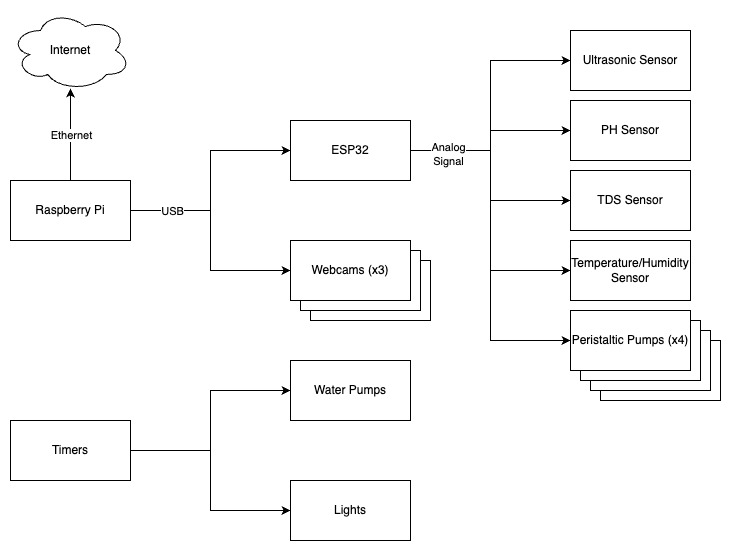
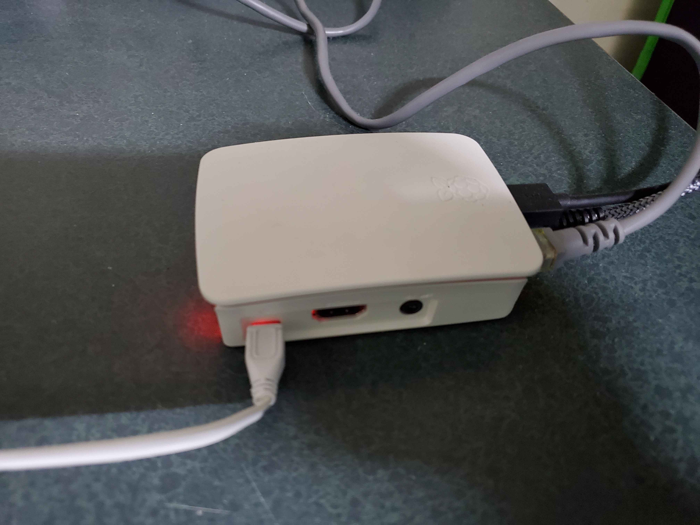
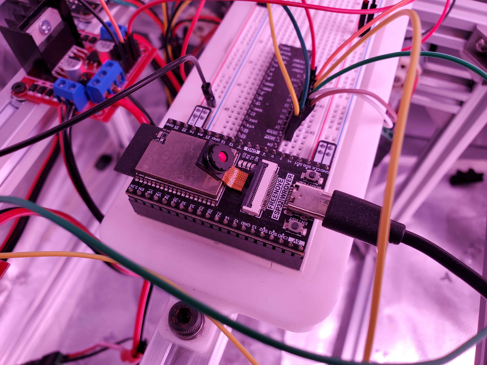
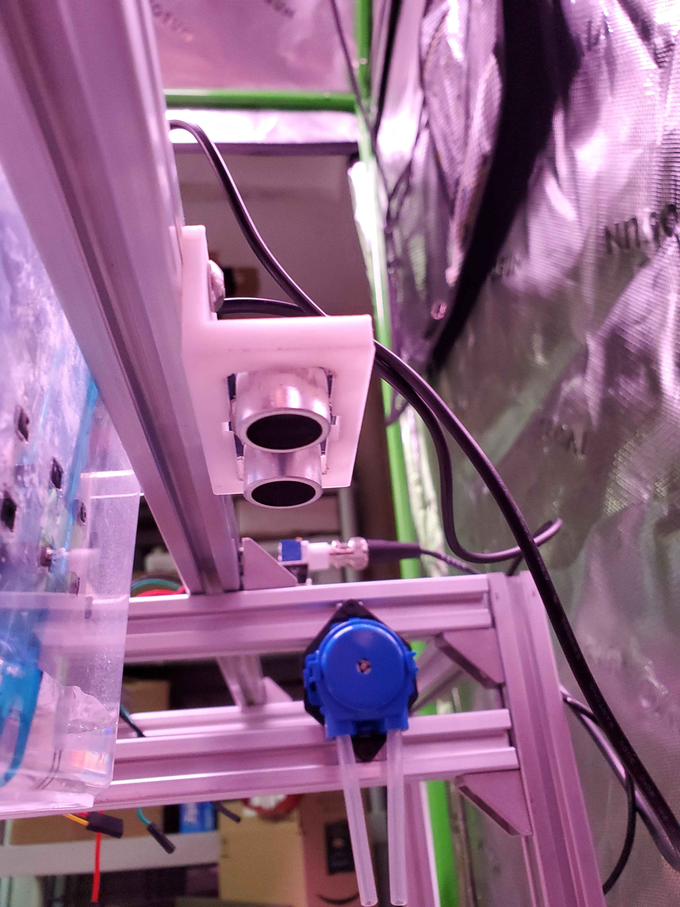
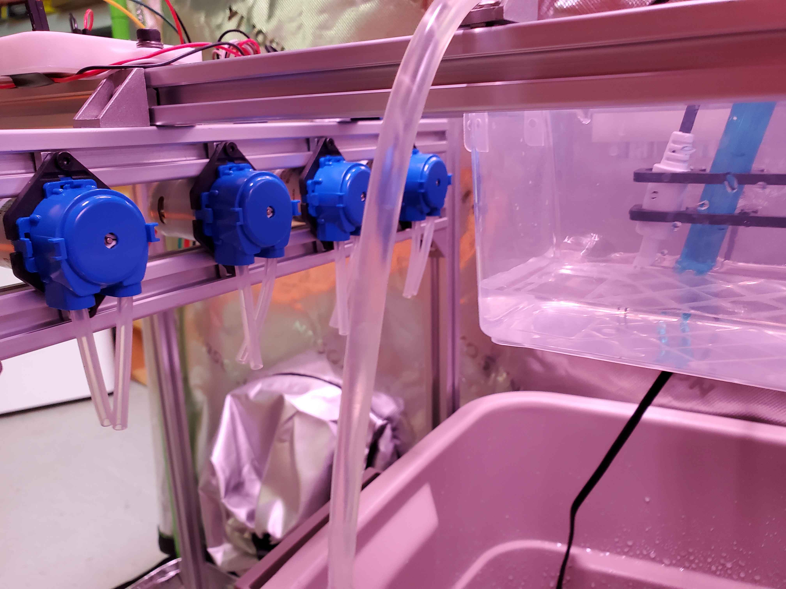
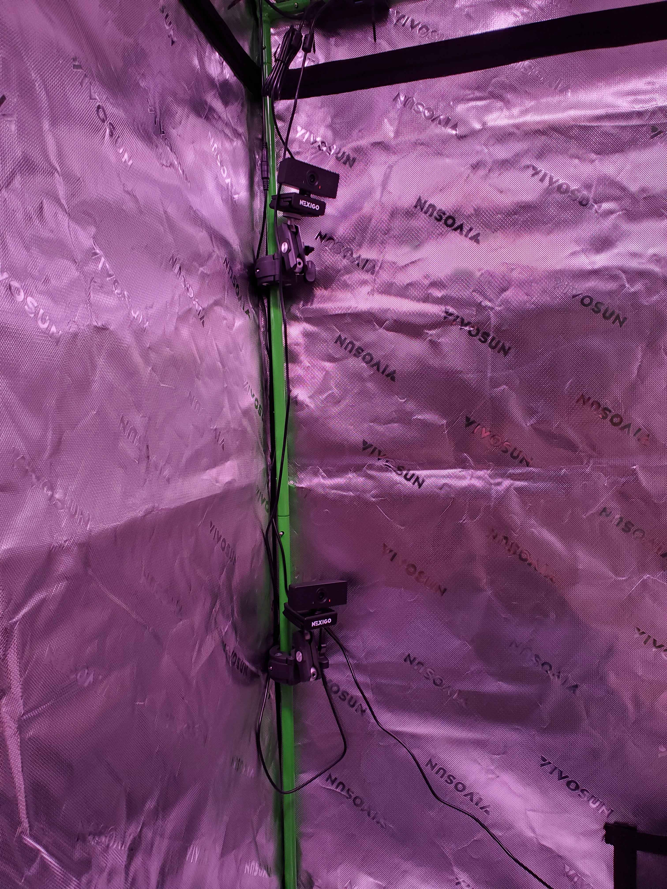
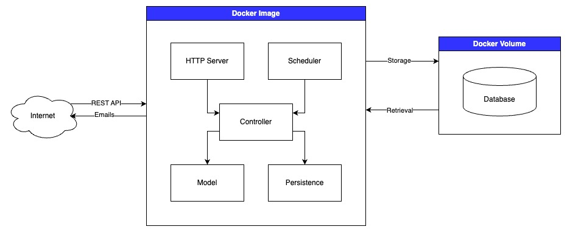

# MLGreenhouse
An automated hydroponics garden that monitors daylight cycles, water flow, nutrient levels, and pH using a Raspberry Pi.
## Physical Architecture
From a physical standpoint, MLGreenhouse is laid out as follows:

### Raspberry Pi

The heart of the software lies in the Raspberry Pi. It manages all resources in the greenhouse, dictating how they interact with each other and the Internet.
### ESP32

The ESP32 controls all sensors and most motors. It receives commands from the Raspberry Pi and sends it data via USB.
#### Ultrasonic Sensor

The ultrasonic sensor measures the distance between itself and the water below it, thus determining the amount of water stored inside.
#### PH Sensor
*image of pH sensor*
The pH sensor obviously measures the pH of the water.
#### TDS Sensor
*image of TDS sensor*
TDS stands for total dissolved solids. As solid begins to accumulate in the system, whether that be through nutrients, algae, or plant residue, the value transmitted by the TDS sensor will increase.
#### Temperature/Humidity Sensor
*image of temperature/humidity sensor*
The temperature/humidity sensor is capable of sending two distinct data values, one corresponding to the temperature of the environment and the other corresponding to the humidity.
#### Peristaltic Pumps

The peristaltic pumps add controlled amounts of liquids to the water reservoir. These can be used to add water when the water supply is low, raise/lower the pH through plant-safe acid and base, and add nutrient to the water.
### Webcams

The webcams are connected directly to the Raspberry Pi and transmit images of the plants whenever the Raspberry Pi requests them.
### Water Pumps
*image of water pumps*
The water pumps are either run continuously or are controlled via a timer, depending on their purpose.
### Lights
*image of lights*
The lights simulate sunlight for the plants and are controlled via an outlet timer.
## Software Architecture
From a software point of view, MLGreenhouse is laid out as follows:

### Docker Image
MLGreenhouse is run through a containerized application. As such, it must be separated into an Docker image (which stores the running program) and a Docker volume (which stores data that persists after the image is no longer running).
#### Model
The model has the following responsibilities:
- *Physical abstraction*: The model abstracts away all physical aspects of the greenhouse. This includes sensors, peristaltic pumps, and webcams.
- *Data visualization*: The model takes sensor data and images, then uses them to generate a report that is more human-readable.
#### Controller
The controller orchestrates the appropriate sequence of function calls when prompted by the scheduler or the HTTP server (see below). It also handles sending emails to the email list.
#### Persistence
The persistence layer abstracts away all aspects of the database layer. It is responsible for storing sensor data in csv format, storing images, and logging all actions taken by the Docker image for debugging purposes.
#### HTTP Server
The HTTP server responds to requests via RESTful API and calls the appropriate controller function calls accordingly.
#### Scheduler
The scheduler calls the appropriate functions from the controller at regularly timed intervals. These responsibilities include polling sensor data throughout the day, taking images of the greenhouse, and sending daily emails to the email list. *Note: Unlike the other components in the Docker image, which each have their own packages, the scheduler is located directly in main.py.*
### Docker Volume
The Docker volume contains all files that persist after the Docker image is no longer running. This includes images, sensor data, and any other files that may be created during runtime.
